# OpenMemory Design Document

A lightweight, local, shared memory system for AI tools and agents via MCP (Model Context Protocol).

## Table of Contents

- [Overview](#overview)
- [Approach](#approach)
- [Architecture](#architecture)
- [Data Model](#data-model)
- [Workflow](#workflow)
- [API Reference](#api-reference)
- [Comparison](#comparison)

---

## Overview

OpenMemory provides persistent, searchable, and controllable memory for AI assistants. Unlike traditional RAG systems that embed everything and perform expensive vector searches, OpenMemory uses a lightweight hybrid retrieval approach.

### Design Principles

| Principle | Description |
|-----------|-------------|
| **Local-first** | All data stays on your machine, no cloud dependencies |
| **Token-efficient** | Minimal context injection, only relevant memories |
| **Fast retrieval** | Target < 10ms search latency |
| **MCP-native** | Standard protocol for AI tool integration |
| **Privacy-first** | No telemetry, no external calls |

---

## Approach

### Why NOT Full RAG?

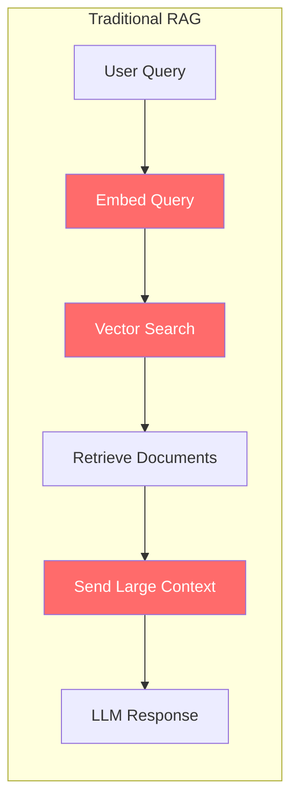

**Problems with traditional RAG:**

| Issue | Impact |
|-------|--------|
| Embed every query | Expensive API calls |
| Vector search | Slow (~100ms+) |
| Large context windows | Token waste |
| Semantic-only matching | Misses keyword relevance |

### Our Hybrid Approach

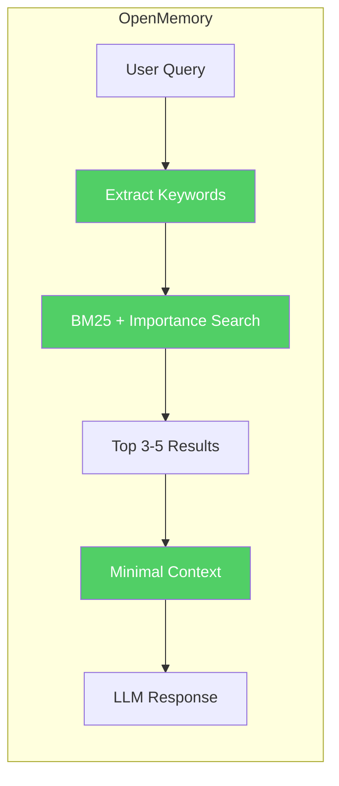

**Hybrid Memory Retrieval:**

1. **Keyword extraction** - Extract key terms from query
2. **BM25 lexical search** - Fast full-text search via OpenSearch
3. **Importance scoring** - User-defined priority weights
4. **Recency boost** - Recent memories rank higher
5. **Minimal extraction** - Return only relevant chunks

### Scoring Formula

```
final_score = importance * 0.6 + recency * 0.4
```

Where:
- `importance`: User-assigned score (0.0 - 1.0)
- `recency`: Exponential decay based on age (e^(-days/30))

---

## Architecture

### System Overview

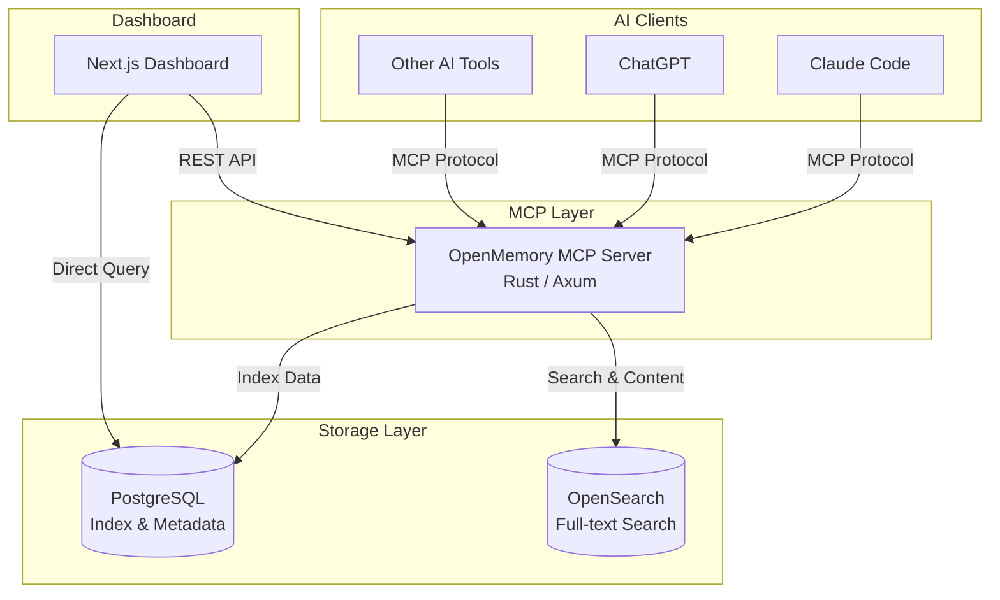

### Component Details

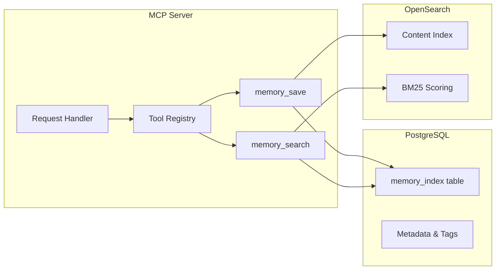

### Tech Stack

| Layer | Technology | Purpose |
|-------|------------|---------|
| **MCP Server** | Rust + Axum | High-performance async server |
| **Metadata Store** | PostgreSQL | Structured data, importance scores, tags |
| **Search Engine** | OpenSearch | BM25 full-text search |
| **Dashboard** | Next.js + shadcn/ui | Memory management UI |
| **Infrastructure** | Docker Compose | One-command deployment |

---

## Data Model

A single memory is split across two stores for optimal performance:

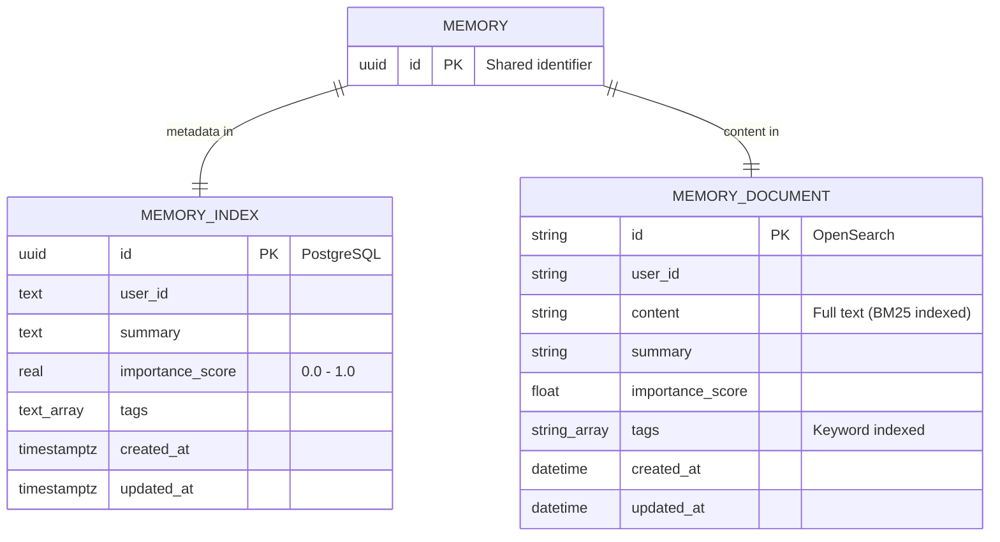

| Store | Purpose | Data |
|-------|---------|------|
| **PostgreSQL** | Fast metadata lookup | id, importance, tags, timestamps |
| **OpenSearch** | Full-text search (BM25) | content, summary, tags |

### Data Flow

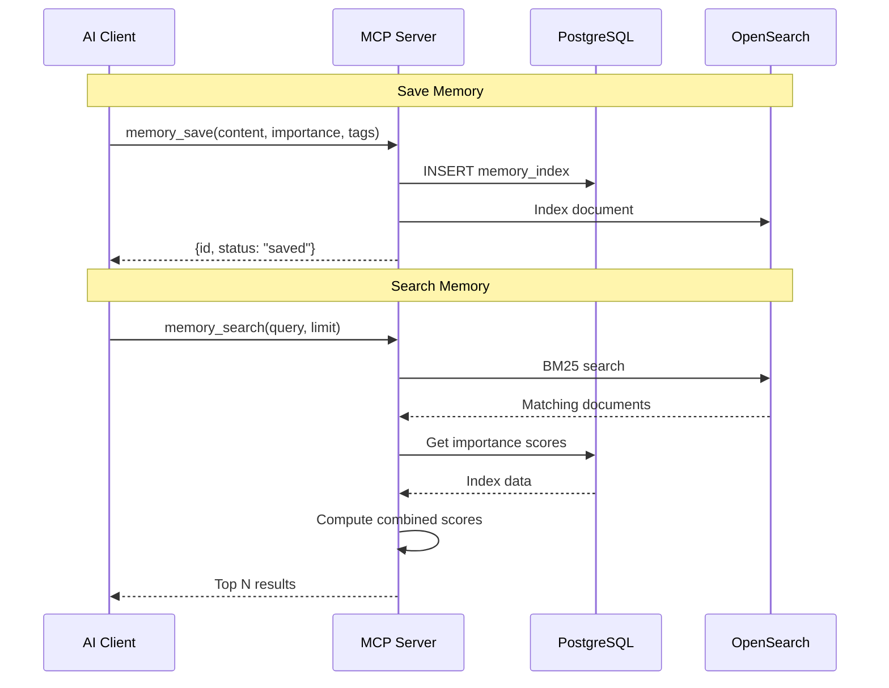

---

## Workflow

### Memory Save Flow

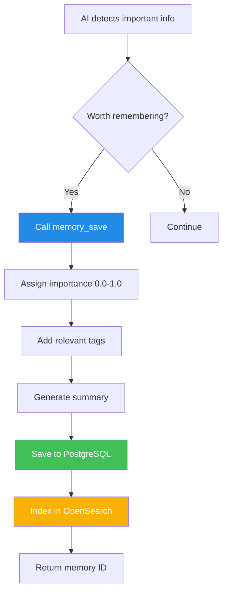

### Memory Search Flow

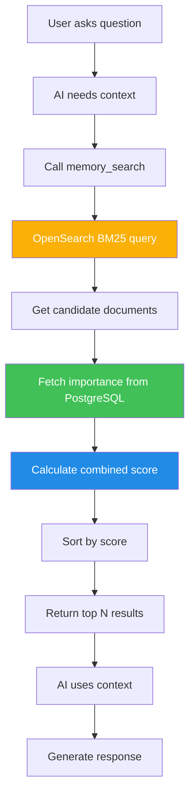

### Typical Conversation Flow

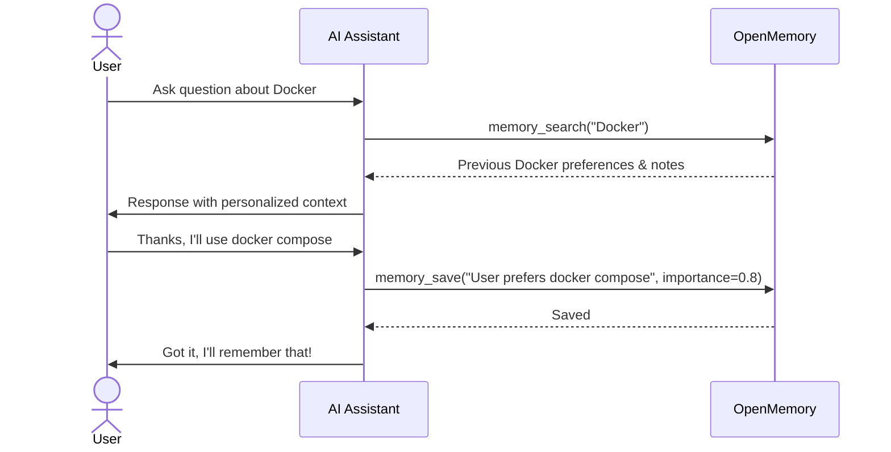

### Memory Toggle States

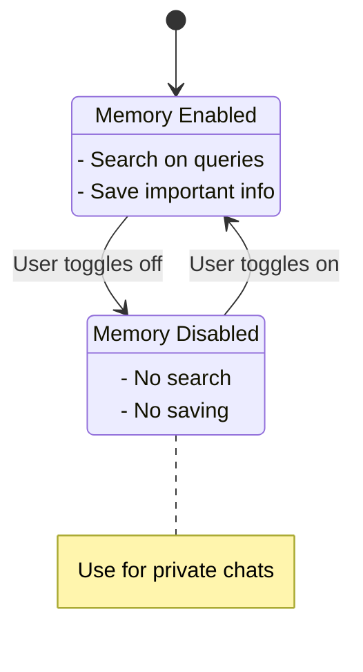

---

## API Reference

### MCP Tools

#### memory_save

Save information to memory for later recall.

```json
{
  "name": "memory_save",
  "arguments": {
    "content": "User prefers TypeScript over JavaScript",
    "summary": "TypeScript preference",
    "importance": 0.8,
    "tags": ["preference", "coding"]
  }
}
```

| Parameter | Type | Required | Description |
|-----------|------|----------|-------------|
| `content` | string | Yes | The information to remember |
| `summary` | string | No | Brief summary for quick reference |
| `importance` | number | No | Priority score 0.0-1.0 (default: 0.5) |
| `tags` | string[] | No | Categorization tags |

#### memory_search

Search memories by keywords.

```json
{
  "name": "memory_search",
  "arguments": {
    "query": "TypeScript preferences",
    "limit": 5
  }
}
```

| Parameter | Type | Required | Description |
|-----------|------|----------|-------------|
| `query` | string | Yes | Search keywords |
| `limit` | number | No | Max results (default: 5, max: 20) |

### Importance Score Guidelines

| Score | Use Case |
|-------|----------|
| 0.9 - 1.0 | Critical preferences, key decisions |
| 0.7 - 0.8 | Important context, project configs |
| 0.5 - 0.6 | General useful information |
| 0.3 - 0.4 | Nice to know, minor details |
| 0.1 - 0.2 | Ephemeral context |

---

## Comparison

### OpenMemory vs Alternatives

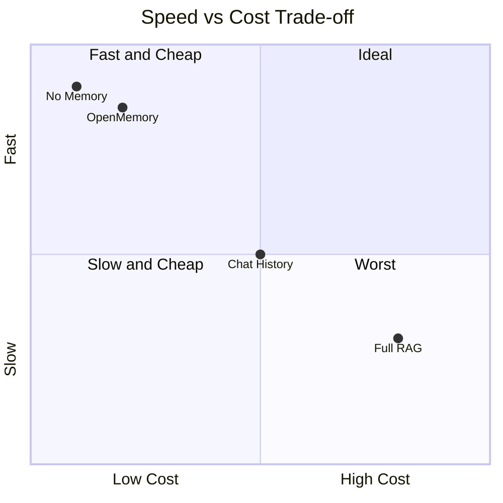

| Method | Cost | Speed | Tokens | Precision |
|--------|------|-------|--------|-----------|
| **OpenMemory** | Low | Fast (<10ms) | Low | High |
| Full RAG | High | Slow (~100ms) | High | Medium |
| Chat History | Medium | Medium | Very High | Low |
| No Memory | None | Instant | None | N/A |

---

## Project Structure

```
openmemory/
├── apps/
│   ├── web/              # Next.js dashboard
│   └── server/           # Rust MCP server
│       └── src/
│           └── mcp.rs    # Core MCP implementation
├── packages/
│   ├── sdk/              # TypeScript SDK
│   └── shared-types/     # Shared type definitions
├── scripts/
│   └── seed-data.py      # Demo data seeder
├── docs/
│   ├── DESIGN.md         # This document
│   └── plan/             # Planning documents
├── docker-compose.yml
└── turbo.json
```

---

## Future Considerations

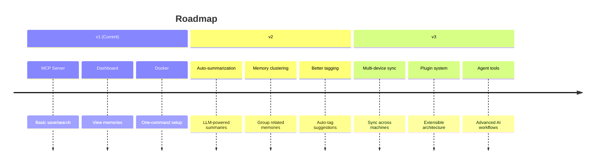

---

## References

- [Model Context Protocol (MCP)](https://modelcontextprotocol.io/)
- [BM25 Algorithm](https://en.wikipedia.org/wiki/Okapi_BM25)
- [OpenSearch Documentation](https://opensearch.org/docs/latest/)
- [Retrieval-Augmented Generation](https://arxiv.org/abs/2005.11401)
