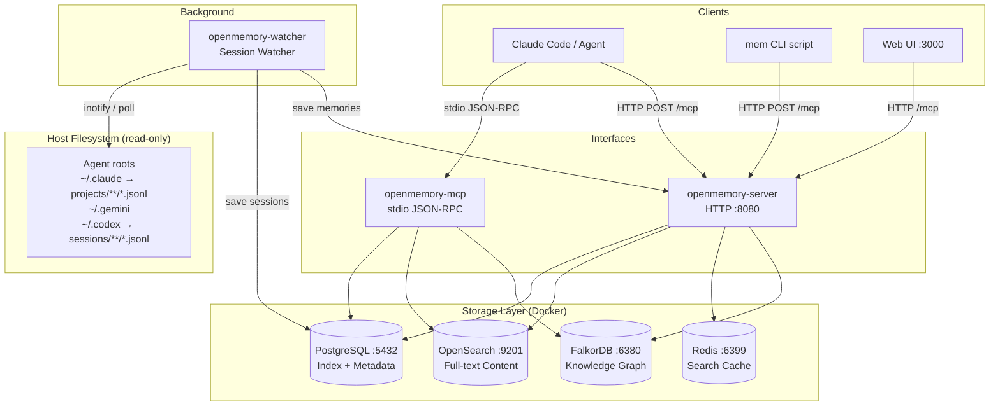
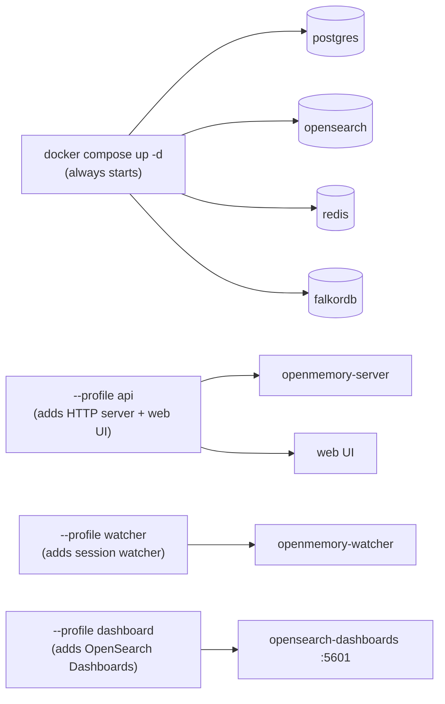
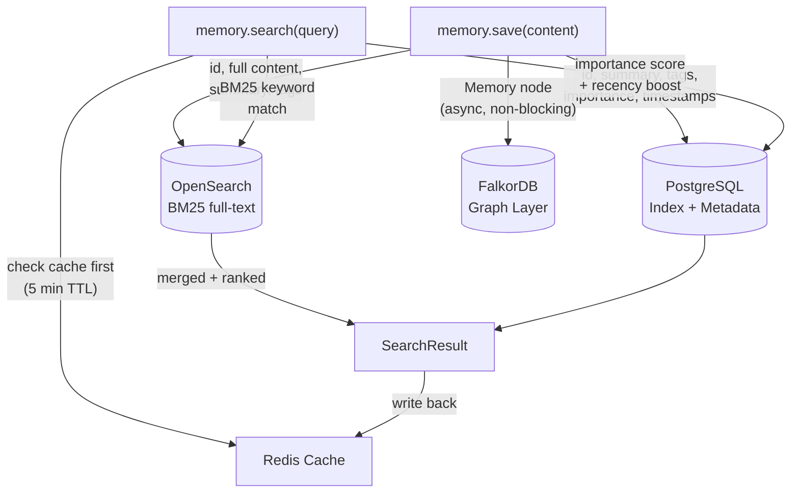

# OpenMemory — System Architecture

## Overview

OpenMemory is a local, persistent memory system for AI agents. It runs entirely on the host machine via Docker and exposes two interfaces: an HTTP API and a stdio JSON-RPC MCP server. A background session watcher passively ingests AI tool conversation logs into memory.

---

## High-Level System Diagram

---

## Service Inventory

| Service | Binary | Port | Role |
|---------|--------|------|------|
| `openmemory-server` | Rust / axum | 8080 | HTTP API — all MCP operations |
| `openmemory-mcp` | Rust / tokio | stdio | Stdio JSON-RPC for Claude Code settings.json |
| `openmemory-watcher` | Rust | — | Background session ingestion |
| `postgres` | PostgreSQL 17 | 5432 | Memory index, env params, session tables |
| `opensearch` | OpenSearch 2.18 | 9201 | Full-text BM25 search on memory content |
| `redis` | Redis 7 | 6399 | 5-minute search result cache |
| `falkordb` | FalkorDB latest | 6380 | Knowledge graph (Memory + Episode + Entity + Fact) |
| `web` | Next.js | 3000 | Browser dashboard (profile: api) |

---

## Docker Compose Profiles

---

## Storage Responsibilities

Each store has a single, non-overlapping responsibility:

---

## Security Model

- All services bind to `localhost` by default; Docker internal networking used between containers
- `OPENMEMORY_API_TOKEN` gates secret `env.get` operations (Bearer auth)
- Env params stored AES-GCM encrypted (key derived from `OPENMEMORY_SECRET_KEY` via HKDF).
  `OPENMEMORY_SECRET_KEY` is required — both the HTTP server and stdio MCP binary
  refuse to start without it (`OPENMEMORY_ALLOW_INSECURE_DEV_KEY=1` opts into the
  well-known dev key for CI/tests only). Rotate it with
  `openmemory-server rotate-secret-key [--dry-run]`, which re-encrypts every
  `env_params` row from `OPENMEMORY_OLD_SECRET_KEY` to `OPENMEMORY_NEW_SECRET_KEY`
  in one transaction.
- FalkorDB and Redis have no auth — localhost-only exposure
- CORS restricted to `localhost` origins unless `OPENMEMORY_CORS_ORIGINS` is set
