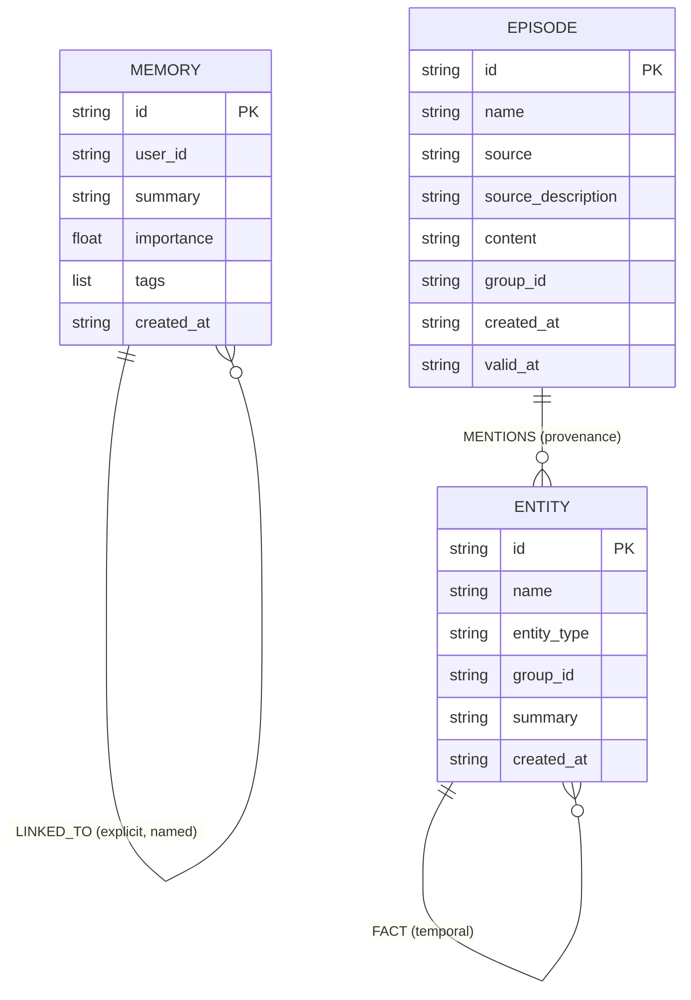
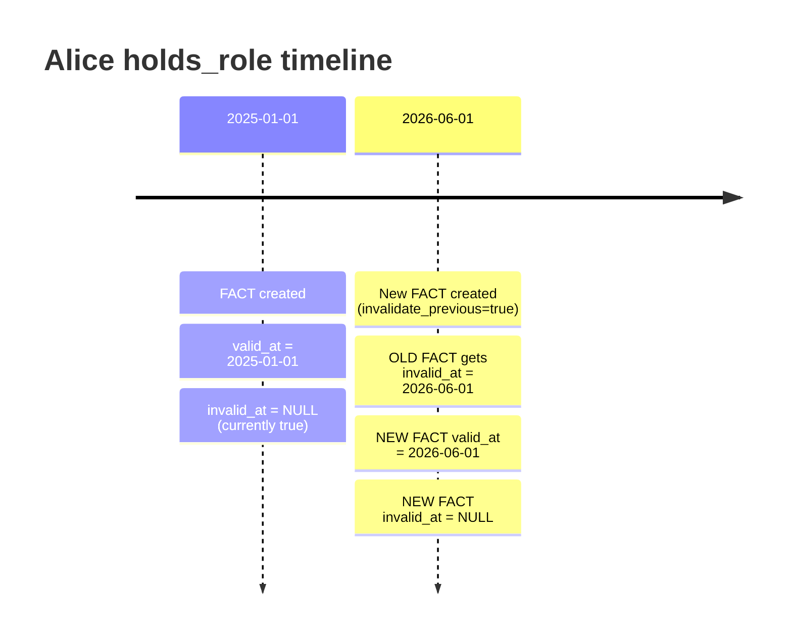
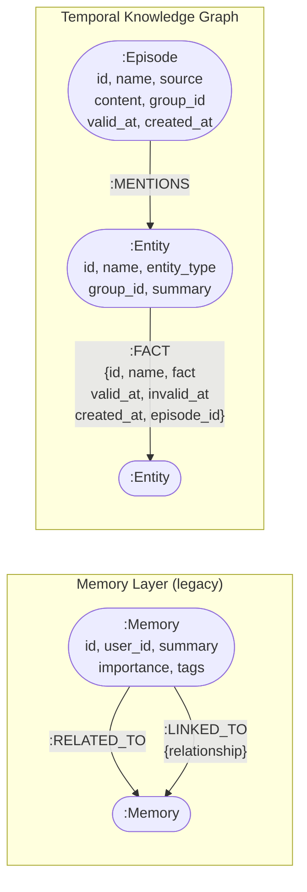
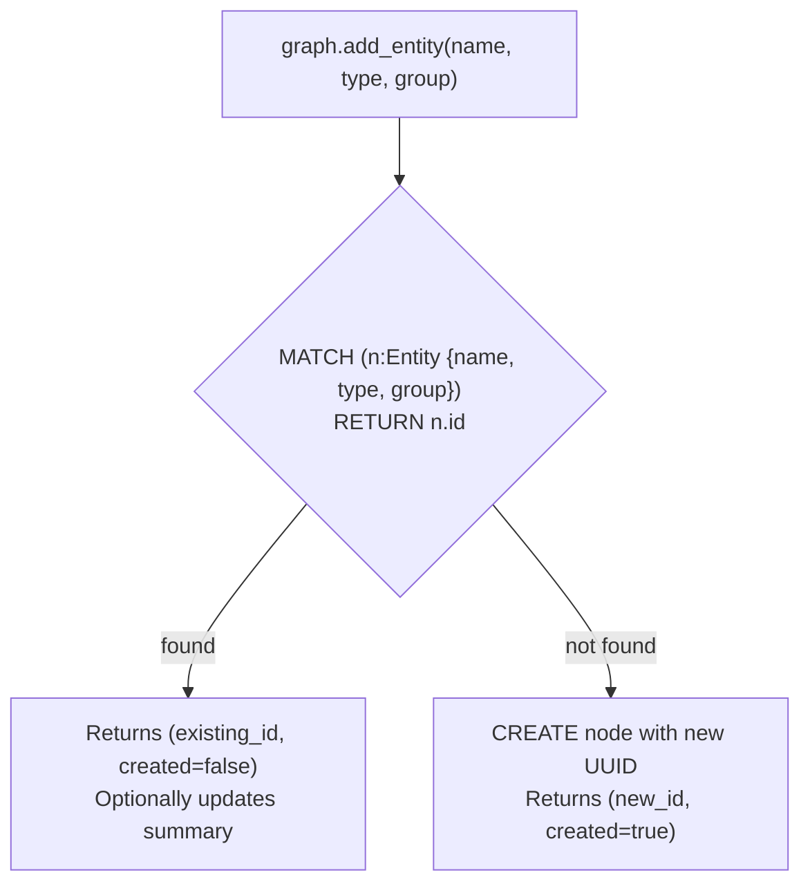

# OpenMemory — Knowledge Graph Schema

The FalkorDB graph holds two logical layers that coexist in the same graph (`openmemory`):

1. **Memory layer** — legacy flat graph mirroring PostgreSQL Memory records (backward compatible)
2. **Temporal knowledge graph** — Graphiti-inspired Episode / Entity / Fact model

---

## Node Types



---

## Edge Types

### Memory Layer (legacy)

| Edge | From → To | Properties | Created by |
|------|-----------|------------|------------|
| `RELATED_TO` | Memory → Memory | — | Auto on save (shared tags) |
| `LINKED_TO` | Memory → Memory | `relationship: String` | `memory.graph_relate` |

### Temporal Knowledge Graph

| Edge | From → To | Properties | Created by |
|------|-----------|------------|------------|
| `MENTIONS` | Episode → Entity | — | `graph.add_entity` with `episode_id` |
| `FACT` | Entity → Entity | `id, name, fact, valid_at, invalid_at, created_at, episode_id` | `graph.add_fact` |

---

## FACT Edge — Temporal Semantics



**Key rules:**
- `invalid_at = NULL` → fact is currently valid
- `invalid_at IS NOT NULL` → fact was superseded at that timestamp
- `valid_at` records when the fact became true in the real world (not when it was entered)
- `created_at` records wall-clock time of insertion

### Querying validity at time T:
```cypher
MATCH (a:Entity)-[f:FACT]->(b:Entity)
WHERE f.valid_at <= "T"
  AND (f.invalid_at IS NULL OR f.invalid_at > "T")
RETURN a.name, f.name, f.fact, b.name
```

---

## Full Graph Schema — Cypher notation



---

## Indexes

Created by `init_indexes()` on startup (idempotent):

| Node | Property | Type |
|------|----------|------|
| `:Memory` | `id` | Exact |
| `:Episode` | `id` | Exact |
| `:Episode` | `group_id` | Exact |
| `:Entity` | `id` | Exact |
| `:Entity` | `name` | Exact |
| `:Entity` | `group_id` | Exact |

---

## Entity Deduplication

Entities are identified by the triple `(name, entity_type, group_id)`. Calling `graph.add_entity` twice with the same triple returns the existing entity ID and updates the summary — it does not create a duplicate node.


