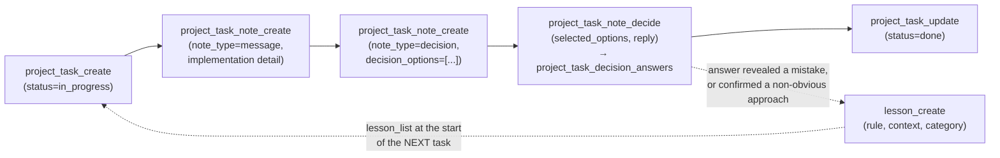

# OpenMemory — Agent Architecture Primitives

Version: 0.2.0 (see [`version/0.2.0.md`](../version/0.2.0.md))

This document is a conceptual reference for contributors and agent-authors building on
OpenMemory. It describes each storage/behavior primitive behind the ~70-tool MCP surface
(catalog: [`apps/server/src/mcp_app/catalog.rs`](../../apps/server/src/mcp_app/catalog.rs)):
what it is, what it stores, who owns it, and — the part nothing else documents — when to
reach for it instead of a neighboring primitive. For "how do I call tool X", see
[`skills/openmemory/SKILL.md`](../../skills/openmemory/SKILL.md). For service topology, see
[architecture.md](./architecture.md). For the temporal graph's internals, see
[temporal-model.md](./temporal-model.md) and [graph-schema.md](./graph-schema.md). For the
workflow engine's step semantics, see [workflows.md](./workflows.md).

---

## System model

OpenMemory is not one memory store — it's roughly a dozen narrow, purpose-built primitives
that share three storage engines (PostgreSQL for structured/relational data, OpenSearch for
full-text recall, FalkorDB for graph traversal) and one access pattern (MCP tools, one
family of tools per primitive). Nothing is generic: each primitive picked its shape to fit
one job — recall, provenance, config, planning, or execution — and agents are expected to
pick the *narrowest* primitive that fits, not the most flexible one. The primitives compose
into two directions of flow: **ingestion** (a session watcher, or an agent directly, turns
raw observation into structured, queryable state — episode → entity/fact → memory) and
**execution** (a project's task list drives notes, decisions, and lessons, and workflows +
env params carry out privileged external side effects safely). The sections below define
each primitive on a fixed template, then a decision section resolves the primitives whose
boundaries are genuinely ambiguous.

---

## Memory

**What it is.** A flat store of free-text, agent-authored recollections — the general
"remember this for later" primitive. Not tied to a project.

**What it stores.** `content` (full text, OpenSearch only), `summary`, `importance` (0–1),
`tags`, `user_id`, timestamps. Auto-linked to other memories via shared-tag edges
(`RELATED_TO`) or explicit named edges (`LINKED_TO`) in the FalkorDB `Memory` node layer.

**Lifetime and ownership.** Permanent until deleted; no expiry. Written by any agent or by
the background session watcher (tagged `[session, project_name]`). Global — not
project-scoped.

**Storage.** Split across all three engines: PostgreSQL (`memory_index` — id, tags,
importance, timestamps; `main.rs:1834`), OpenSearch (full content, BM25 search), FalkorDB
(`:Memory` node, fire-and-forget). See [workflows.md §1–2](./workflows.md) for the write/read
sequence.

**MCP tools.** `memory_save`, `memory_search`, `memory_graph_neighbors`, `memory_graph_relate`.

**Use instead of its neighbors when:** the fact is a durable, standalone statement useful
across sessions and projects, and doesn't need bi-temporal tracking, doesn't belong to one
project's task history, and isn't a "don't repeat this mistake" rule. See
[Choosing between primitives](#choosing-between-primitives).

---

## Temporal knowledge graph (episode / entity / fact)

**What it is.** A Graphiti-inspired, bi-temporal graph for structured facts about
real-world entities — not prose, but subject–relation–object assertions with a validity
window.

**What it stores.** Three node/edge kinds in FalkorDB:
- `:Episode` — immutable source record (never deleted, never edited)
- `:Entity` — a deduplicated real-world thing, keyed on `(name, entity_type, group_id)`
- `:FACT` edge — a temporal assertion between two entities, carrying `valid_at`,
  `invalid_at` (NULL = still true), and `episode_id` for provenance

Full schema: [graph-schema.md](./graph-schema.md). Bi-temporal semantics and invalidation
flow: [temporal-model.md](./temporal-model.md).

**Lifetime and ownership.** Episodes are permanent ground truth. Entities are
upserted/deduplicated. Facts are soft-invalidated (never deleted) when superseded via
`invalidate_previous=true`, which scopes to the exact `(subject, object, fact_name)` triple.
Namespaced by `group_id` (default `"default"`).

**MCP tools.** `graph_add_episode`, `graph_add_entity`, `graph_add_fact`,
`graph_query_facts`, `graph_query_at`, `graph_get_entity_history`, `graph_get_entity`.

**Use instead of memory when:** the information is a structured relationship between named
entities that can change over time and you need to ask "what was true on date X" or "what
is the current value of Y's role" — not just "what do I recall about Y."

---

## Environment parameters (env params) & credential-safe HTTP

**What it is.** An encrypted key/value secrets and config store, plus a family of tools
that let an agent *use* a secret (HTTP auth, JWT signing, SSH, Google service accounts)
without the secret's value ever being returned to the agent.

**What it stores.** `env_params` table (PostgreSQL): `key`, `value_encrypted` (AES-GCM,
key derived from `OPENMEMORY_SECRET_KEY` via HKDF), `is_secret`, `description`
(`main.rs:1865`). Secret values are unreadable by agents (`env_get` errors on them);
normal (non-secret) values are readable. Rotation is handled by
`openmemory-server rotate-secret-key`.

**Lifetime and ownership.** Permanent until deleted or renamed (`env_rename` preserves the
encrypted value across a key rename and updates any resources that reference it). Global —
no project scoping.

**MCP tools.** `env_set`, `env_set_file`, `env_get`, `env_list`, `env_rename`, `env_delete`,
plus the execution primitives that consume secrets server-side: `env_http_request`,
`env_http_download`, `env_http_request_jwt`, `env_http_request_oauth1`, `env_sign_jwt`,
`env_google_service_account_request`, `env_ssh_execute`.

**Security model.** Every `env_http_*`/`env_ssh_execute` call resolves the secret inside the
server process and only returns the response body to the agent — the raw key, JWT, or
signed token is never serialized back over MCP (see docstrings for each tool in
`catalog.rs:452-780`). `env_ssh_execute` additionally requires an explicit
`OPENMEMORY_SSH_ALLOWED_HOSTS` allowlist and a pinned host-key fingerprint before it will
connect to a new host — fail-closed by default.

**Use instead of a plain HTTP call when:** the operation needs a credential at all. There is
no tool that hands a secret's plaintext to an agent for it to build its own request —
`env_http_request` family is the only sanctioned path, by design.

---

## Resources

**What it is.** A catalog of *locations* — local filesystem paths and website URLs — that
agents can discover instead of guessing. Not a place for content, just a name → location
(+ optional bundled credentials) mapping.

**What it stores.** Manual rows in the `resources` table: `name` (unique), `kind` (`'path'`
or `'url'` — enforced by a `CHECK` constraint, `resources.rs:83`), `location`, `description`,
`tags`, `env_param_keys` (a list of existing env param keys bundled as one account's
credentials — e.g. `api_key` + `team_id` + `token` for one integration). Env-declared
resources (`RESOURCE_PATH.<slug>` / `RESOURCE_URL.<slug>` / `RESOURCE_AUTH.<slug>`) are
merged in at list/get time with no DB row required (`resources.rs:353-451`); manual rows win
on name/location collision.

**Lifetime and ownership.** Permanent until deleted. Global, not project-scoped.

**MCP tools.** `resource_add`, `resource_list`, `resource_get`, `resource_update`,
`resource_delete`, `resource_tags`.

**Use instead of a memory or a hardcoded path when:** an agent (this session or a future
one) will need to find a file, dataset, or external site again, especially one that pairs
with stored credentials via `env_param_keys`.

---

## Asset library

**What it is.** A CRUD-only, non-project-scoped catalog of visual/media/code *candidates*
worth browsing and comparing later — generated icon renders, preview frames, or
self-contained interactive HTML/CSS/JS prototypes. No review-state workflow (no
pending/picked/rejected) — it's storage + listing, nothing more
(`library.rs:1-9`).

**What it stores.** `library_entries` table: `label`, `kind` (`image` | `video` | `code`),
`category` (fixed enum: `ui`, `design-system`, `effects`, `animation`, `other` —
`library.rs:137`), `location` (file path or URL — required for image/video) or `code`
(self-contained HTML rendered live in a sandboxed iframe — for `kind: code`), `description`,
`tags`, and an *optional* `project_id` for loose association (unlike `project_tasks`, which
requires a project).

**Lifetime and ownership.** Permanent until deleted. Global by default, loosely
project-taggable.

**MCP tools.** `library_add`, `library_list`, `library_get`, `library_delete`.

**Use instead of a resource when:** the thing being cataloged is a candidate output to
browse/compare (a design iteration, a rendered asset), not a location an agent needs to go
read from or write to.

---

## Projects, tasks, notes, and decisions

**What it is.** The project-scoped planning and execution-tracking primitive: a project has
tasks, tasks have an append-only note stream, and notes can be decision checkpoints that a
human or agent answers.

**What it stores.**
- `project_graphs` — a registered project (name, optional filesystem `path` that gets
  indexed into a code graph — see [Project code graphs](#project-code-graphs) — description).
  A project can exist with no path at all, as pure task management (`main.rs:project_create`
  doc: *"Folder path is optional — omit it for a pure task-management project"*).
- `project_tasks` — `title`, `description`, `status` (`todo` | `in_progress` | `done` |
  `cancelled` | `scheduled`), `priority`, `assigned_to` (`human` | `agent` | null),
  `parent_id` (subtasks), `start_date`/`due_date` (`bootstrap.rs:121-137`).
- `project_task_notes` — append-only implementation notes/handoffs/decisions
  (`note_type`: `message` | `decision`), attributed to `author`. A decision note can carry up
  to six `decision_options` and a `decision_selection_mode` (`single` | `multiple`).
- `project_task_decision_answers` — every answer to a decision note, kept in full history
  (re-answering doesn't overwrite — `bootstrap.rs:176-194`): `selected_options`, `reply`,
  `answered_by`.

**Lifetime and ownership.** Tasks/notes/decisions persist until deleted; decision history is
append-only by design (an audit trail of who decided what, and when it changed). Owned by
one project (`ON DELETE CASCADE` from `project_graphs`).

**MCP tools.** `project_list`, `project_create`; `project_task_list`, `project_task_create`,
`project_task_update`, `project_task_delete`; `project_task_note_list`,
`project_task_note_create`, `project_task_note_decide`.

**Use instead of a memory when:** the content is scoped to one unit of work in one project —
an implementation detail, a handoff message, or a question that needs a recorded answer —
rather than a durable fact worth recalling independent of any task.

---

## Lessons

**What it is.** A structured "don't repeat this mistake / do keep doing this" store, scoped
to a project. Explicitly the structured successor to a `tasks/lessons.md` convention
(`main.rs:2079`, comment: *"structured equivalent of tasks/lessons.md"*).

**What it stores.** `project_lessons`: `title`, `rule` (the instruction to follow going
forward), `context` (what happened that produced it), `category` (`correction` |
`discovery` | `convention` | `pitfall`), `severity` (`low` | `medium` | `high`), `status`
(`active` | `archived`), `tags`, and `occurrences` — creating a lesson with a title that
already exists (active, same project) bumps `occurrences` instead of duplicating
(`catalog.rs:1159`).

**Lifetime and ownership.** Persists until archived or deleted; archiving (not deleting) is
the recommended way to retire a superseded lesson so the history survives. Project-scoped.

**MCP tools.** `lesson_create`, `lesson_list` (cross-project search when `project_id` is
omitted), `lesson_update`, `lesson_delete`.

**Use instead of a task note when:** the insight is a generalizable rule that should
change future behavior across *any* task in the project, not a record of what happened in
*this* task.

---

## Routines

**What it is.** A recurring-task template: a routine materializes a dated task each time
`routine_check` runs and the routine is due.

**What it stores.** `project_routines`: `title` (date appended when materialized),
`description`, `frequency` (`daily` | `weekly` | `monthly`), `priority`, `assigned_to`,
`last_task_date`, `enabled`. Materialized tasks link back via `project_tasks.routine_id`
(`main.rs:2075` / `bootstrap.rs:230`).

**Lifetime and ownership.** The routine template persists until deleted; each run creates an
ordinary `project_tasks` row (independently lived — deleting the routine does not cascade to
tasks it already created, since the FK is `ON DELETE SET NULL`).

**MCP tools.** `routine_create`, `routine_list`, `routine_check` (materializes due routines
as tasks; `dry_run` previews without creating).

**Use instead of manually creating a recurring task when:** the same task genuinely repeats
on a fixed cadence — routines exist to remove the "did I already create today's task"
bookkeeping, not for one-off scheduling.

---

## Workflows

**What it is.** A reusable, deterministic multi-step process definition with two step kinds:
`http` (executes entirely server-side) and `agent` (pauses the run and hands the calling
agent a typed `action_required`, which the agent performs, then resumes with
`workflow_continue`). "OpenMemory never becomes a remote shell" — agent steps only ever
request an image-generation, skill, or command *capability*; they don't grant arbitrary
execution (`workflows.rs:1-5`, `workflows.rs:216`).

**What it stores.** `workflows` table: `name` (unique), `input_schema` (typed: `text` /
`json` / `object` / `number` / `boolean` / `image` / `pdf` / `file`, with a `required` flag —
`workflows.rs:239-280`), `steps` (JSON array, max 20 — `MAX_STEPS`, `workflows.rs:19`).
`workflow_runs` table: one row per execution — `input`, `current_step`, `step_results`,
`status` (`running` | `action_required` | `failed` | `completed`).

**Step semantics (verified in code):**
- `http` steps: method must be GET/POST/PUT/PATCH/DELETE; URL is validated against
  `OPENMEMORY_HTTP_ALLOWED_HOSTS` if set (`validate_allowed_host`, `workflows.rs:431-449`);
  auth secret resolved server-side via `env_params`, injected as header (default), full URL,
  or query param (`execute_http_step`, `workflows.rs:471-517`); templating supports
  `{{input.x}}` and `{{steps.stepid.body.x}}` tokens (`render_string`,
  `workflows.rs:392-412`); response capped at 1 MB (`MAX_RESPONSE_BYTES`).
- `agent` steps: `capability` must be one of `image_generation` | `skill` | `command`
  (`workflows.rs:214-227`); the run persists as `action_required` and
  `workflow_continue` resumes it with the agent's structured result.
- `http` is the default kind when a step omits `kind` (`default_step_kind()`,
  `workflows.rs:75`).

**Lifetime and ownership.** Definitions persist until deleted. Runs persist their full step
history (auditable). Global, not project-scoped.

**MCP tools.** `workflow_list`, `workflow_get`, `workflow_run`, `workflow_continue`.

**Use instead of manually reproducing an integration sequence when:** the same multi-step
HTTP/agent sequence recurs — a workflow makes it declarative, auditable via `workflow_runs`,
and safe (secrets never touch the agent on `http` steps).

---

## Project code graphs

**What it is.** A knowledge graph built by indexing a real folder on disk — tree-sitter
parsing of Rust/TypeScript/JavaScript/Python, plus file nodes for everything else — for
"how does X connect to Y" questions about a codebase. Distinct from the temporal knowledge
graph: this one lives in PostgreSQL as a JSON blob per project, not FalkorDB.

**What it stores.** `project_graphs.graph_data` (JSONB, NetworkX node-link format: `nodes`
+ `links`/`edges`), `node_count`, `edge_count`, `graph_hash` (used to skip a no-op rebuild),
`version_status`. Large graphs (>2,000 visible nodes — `GRAPH_SUMMARY_NODE_LIMIT`,
`project_graphs.rs:97`) are aggregated by community into a summary view for the default
response; the full graph is available via an explicit detail request
(`summary_graph_data`, `project_graphs.rs:100-249`).

**Query mechanics.** `project_graph_query` uses IDF-weighted BFS: seed nodes are the top
keyword matches (with a hub-avoidance rule that skips nodes with degree > 50 when
lower-degree candidates exist — `project_graphs.rs:401-428`), then BFS expands `hops`
(default 2, max 4) from those seeds, capped at `limit` (default 50, max 200).
`project_graph_shortest_path` and `project_graph_god_nodes` are plain BFS/degree-ranking
utilities over the same adjacency.

**Lifetime and ownership.** One graph per registered project; `project_graph_rebuild`
re-indexes from disk and is a no-op if the hash is unchanged. Deleting the graph does not
touch files on disk.

**MCP tools.** `project_graph_list`, `project_graph_create`, `project_graph_query`,
`project_graph_node_detail`, `project_graph_shortest_path`, `project_graph_god_nodes`,
`project_graph_delete`, `project_graph_rebuild`.

**Use instead of grepping the repo when:** the question is relational ("what connects to
what," "what's the shortest dependency path," "what are the hub modules") rather than
textual — the code graph answers structure questions a text search can't.

---

## Forecasts and design budgets

**What it is.** Two small, related planning primitives: a *forecast profile* is a reusable
usage/scale assumption set (independent of any one design); a *design budget* is a concrete
monthly cost estimate attached to one project design, optionally derived from a forecast
profile.

**What forecasts store.** `forecast_profiles`: `application_type` (enum: `web_saas`,
`mobile`, `ai`, `data`, `internal`, `ecommerce`, `other`), `user_count`,
`monthly_budget_usd`, `stress_tolerance` (`conservative` | `balanced` | `aggressive`),
`usage_pattern` (`steady` | `bursty` | `seasonal`), `engagement_percent` (validated
1–100 — `forecasts.rs:60-61`), `planning_horizon_months`, `annual_growth_percent`, `notes`.
Global, reusable across designs.

**What design budgets store.** `design_budget_forecasts`: scoped to one
`design_id` (`ON DELETE CASCADE` from `project_designs`), optionally
`forecast_profile_id`, `line_items` (JSONB array, max 50 — `MAX_LINE_ITEMS`,
`design_budgets.rs:7`; each `{service, usage, monthly_cost_cents, notes}`),
`confidence` (`low` | `medium` | `high`), `pricing_basis`. `monthly_total_cents` is *always*
derived from `line_items`, never set directly (`monthly_total_cents()`,
`design_budgets.rs:85-87`) — the API forbids passing a total that could drift from the
sum.

**Lifetime and ownership.** Forecast profiles persist until deleted, independent of designs.
Design budgets are deleted when their design is deleted.

**MCP tools.** Forecasts: `forecast_list`, `forecast_create`, `forecast_update`,
`forecast_delete`. Design budgets: `design_budget_list`, `design_budget_create`,
`design_budget_update`, `design_budget_delete`. Related: `project_design_delete`.

**Use instead of a note when:** the numbers need to be structured, summed, and reusable
(a monthly total derived from named line items) rather than prose.

---

## Session recording

**What it is.** A background, read-only ingestion pipeline — not an MCP primitive an agent
calls directly, but a passive process that turns AI coding-tool conversation logs into
queryable session records and, selectively, into [memories](#memory).

**What it stores.** `sessions` (one row per Claude Code/Gemini/Codex JSONL session file:
`project_name`, `git_branch`, `cwd`, `agent_name`, `started_at`, `last_event_at`,
`message_count`), `session_messages` (one row per parsed JSONL line, deduplicated on
`(session_id, byte_start)` — a byte-offset key chosen because it's stable even for events
with no `uuid`, `session.rs:69-70`), `watcher_cursors` (crash-recovery byte offset per file),
`watcher_agents` (per-tool recording config — seeded with Claude Code, Gemini CLI, Codex CLI
enabled by default, GitHub Copilot disabled pending a configured log path,
`session.rs:151-159`).

**Lifetime and ownership.** Append-only; not deleted by normal operation. Populated
exclusively by the `openmemory-watcher` background process reading
`~/.claude/projects/**/*.jsonl` (and Gemini/Codex equivalents) via inotify or polling — see
[workflows.md §5](./workflows.md).

**Relationship to memory.** The watcher pairs each user turn with its assistant reply and
POSTs it to `memory.save` tagged `[session, project_name]` — this is the *only* place
session transcripts become memories, and it happens automatically. Agents should not
manually re-save conversation content as memory (see
[skills/openmemory/SKILL.md](../../skills/openmemory/SKILL.md): *"Never save chat logs...
The session watcher already records supported agent conversations; duplicating them
pollutes retrieval"*).

**MCP exposure.** None directly from this table set — inspect via the `mem sessions` CLI
subcommand (`mem sessions`, `mem sessions messages <uuid>`), not an MCP tool.

---

## Choosing between primitives

The boundaries above are mostly clean, but four pairs are genuinely easy to confuse in the
moment. Be concrete and opinionated:

**Memory vs. lesson vs. task note vs. graph fact** — the four ways to "write something
down," disambiguated by *what kind of claim it is* and *who it's for*:

| | Memory | Lesson | Task note | Graph fact |
|---|---|---|---|---|
| Claim shape | Free-text recollection | A rule to follow going forward | A record of what happened in one task | A structured, time-bound relationship between two named entities |
| Scope | Global, cross-project | One project, applies to all future tasks | One task | Namespaced by `group_id`, entity-centric |
| Triggered by | "This is worth remembering" | A correction, or a validated non-obvious choice | Progress, a handoff, or a decision needing an answer | "X relates to Y, and that changed at time T" |
| Wrong tool if... | ...it should change future *behavior*, not just be recalled → lesson | ...it's about *this task only*, not a general rule → task note | ...it needs to be found again outside this task's context → memory or lesson | ...it's prose, not a subject–relation–object triple → memory |

Concretely: "the deploy script needs `--force` on staging" learned from a mistake → lesson
(`category: pitfall`). "Ran the migration, it took 40s, no errors" → task note. "Alice is now
the on-call lead for payments, effective March 1" → graph fact (it's a dated, queryable
relationship). "The team prefers PRs under 400 lines" → memory (durable, cross-project,
non-task-specific, not a correction-from-mistake rule).

**Resource vs. library entry vs. memory (for "where's the thing")** — a resource is a
*location* an agent will go read from or authenticate to (a path, a URL, optionally bundled
credentials); a library entry is a *candidate artifact* worth browsing/comparing (a
rendered image, an HTML prototype); a memory noting a location in prose ("the config lives
in `~/.foo`") is a last resort — if it'll be looked up again, register it as a resource
instead so `resource_list`/`resource_get` can find it programmatically.

**Workflow vs. env_http_request vs. a project code graph query** — not really
overlapping, but the "when do I formalize" question comes up: a one-off authenticated call
is `env_http_request`; the same multi-step sequence run more than once becomes a
`workflow`; neither is for exploring a codebase's structure, which is what
`project_graph_query` is for.

**Forecast profile vs. design budget** — a forecast profile is an assumption set
(*"this app has 10k users, bursty traffic, $2k/mo budget"*) reusable across many designs; a
design budget is one concrete costed estimate for one design, which may *reference* a
forecast profile but always derives its total from its own line items. Don't put line items
in a forecast profile, and don't make a new forecast profile per design if the same
assumptions apply to several.

---

## Composition walkthroughs

### (a) Session watcher → episode → entity/fact → memory

This is the *ingestion* direction: raw observation becomes progressively more structured.

```mermaid
flowchart LR
    FS["~/.claude/projects/**/*.jsonl"]
    WATCH["openmemory-watcher\n(inotify/poll)"]
    SESS[("sessions +\nsession_messages")]
    MEM_SAVE["memory.save\n(user+assistant pair,\ntags=[session,project])"]
    MEM[("Memory\n(OpenSearch + PG + FalkorDB)"]

    AGENT["Agent, mid-session,\nnotices a durable fact"]
    EPISODE["graph.add_episode\n(immutable source record)"]
    ENTITY["graph.add_entity\n(Alice: Person)\n(Manager: Role)"]
    FACT["graph.add_fact\n(Alice --holds_role--> Manager,\nvalid_at=...)"]

    FS --> WATCH --> SESS
    WATCH --> MEM_SAVE --> MEM

    AGENT --> EPISODE --> ENTITY --> FACT
    AGENT -.->|"if durable & cross-project,\nnot just this one relationship"| MEM_SAVE
```

Two independent paths into memory: the watcher's automatic, unstructured path (every
session, no agent involvement) and an agent's deliberate, structured path through the
temporal graph when the fact is a dated relationship between named entities worth querying
later (`graph_query_at`, `graph_get_entity_history`). An agent should only call `memory_save`
directly for a genuinely durable, standalone conclusion — not to re-log what the watcher
already captured.

### (b) Task → note → decision → lesson

This is the *execution* direction: a project task generates a record, the record surfaces a
choice, the choice's outcome (if it was a mistake or a validated non-obvious call) becomes a
lesson for next time.



The decision note keeps full answer history even across re-answers
(`project_task_note_decide` appends to `project_task_decision_answers` rather than
overwriting), so a task's record stays an honest audit trail. Not every task produces a
lesson — only when the outcome should change *future* behavior beyond this one task, which
is the same test used in [Choosing between primitives](#choosing-between-primitives) above.

---

## Tool coverage

Every MCP tool name in `catalog.rs` falls under exactly one primitive section above. Verified
by cross-referencing `grep -oE '"name": "[a-z_0-9]+"' apps/server/src/mcp_app/catalog.rs`
against the tool lists in each section — see the coverage check in this doc's PR/task
history for the full mapping.
