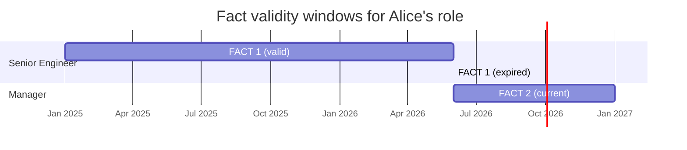
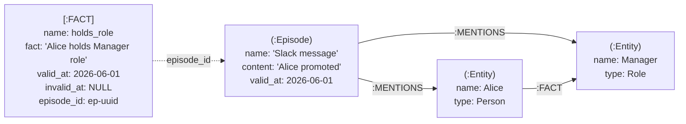
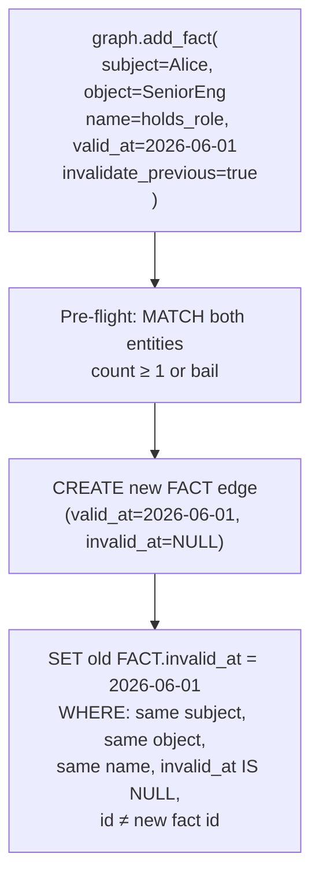

# OpenMemory — Temporal Knowledge Graph Model

Inspired by [Graphiti](https://github.com/getzep/graphiti). The temporal graph layer gives agents structured, time-aware memory — not just flat document retrieval.

---

## Core Concepts

| Concept | Node/Edge | Description |
|---------|-----------|-------------|
| **Episode** | `:Episode` node | Immutable source record — what was observed/said/recorded. Ground truth. Never deleted. |
| **Entity** | `:Entity` node | Real-world thing that persists over time (person, place, org, concept). Deduplicated. |
| **Fact** | `:FACT` edge | A temporal assertion between two entities. Has a start (`valid_at`) and optional end (`invalid_at`). |
| **Provenance** | `:MENTIONS` edge | Links an Episode to every Entity it introduced. Traces any fact back to its source. |

---

## Bi-temporal Model

Every fact carries two timestamps:

```
created_at   — wall clock when the fact was inserted into the system
valid_at     — when the fact became true in the real world
invalid_at   — when the fact stopped being true (NULL = still true today)
```

This separates **data entry time** from **fact time**, enabling:
- Late entry: "Alice was promoted on Jan 1, recorded on Jun 2"
- Historical queries: "What was true on March 15?"
- Auditing: "When did we learn about this?"



---

## Provenance Chain

Every entity and fact can be traced back to the episode that created it:



---

## Query Patterns

### "What is true right now?"
```
graph.query_facts(query="Alice", valid_only=true)
```
Filters: `f.invalid_at IS NULL AND f.valid_at <= NOW()`

### "What was true on a specific date?"
```
graph.query_at(timestamp="2025-07-01T00:00:00Z", entity_name="Alice")
```
Filters: `f.valid_at <= T AND (f.invalid_at IS NULL OR f.invalid_at > T)`

### "Show me everything that ever happened to Alice"
```
graph.get_entity_history(entity_name="Alice")
```
Returns all FACT edges (current + expired), sorted by `valid_at` DESC.

### "Find facts about a topic"
```
graph.query_facts(query="deployment pipeline")
```
`CONTAINS` search across: `f.fact`, `f.name`, `a.name`, `b.name` (case-insensitive via `toLower()`).

---

## Invalidation Semantics

`invalidate_previous=true` **scopes invalidation to the exact (subject, object, fact_name) triple**:



**To change an entity's relationship to a different object** (e.g. Alice leaves SeniorEng and joins Manager), the agent issues two operations:
1. `add_fact(Alice → SeniorEng, holds_role, invalidate_previous=true)` — closes the old fact
2. `add_fact(Alice → Manager, holds_role, valid_at=...)` — opens the new fact

---

## Timestamp Normalization

All caller-supplied timestamps (`valid_at`, `timestamp`) are normalized to UTC RFC3339 before storage:

```
"2026-06-01T09:00:00+09:00"  →  "2026-06-01T00:00:00+00:00"
"2026-06-01"                 →  stored as-is (invalid ISO 8601 — warn log, no crash)
```

Normalization happens in `normalize_ts()` in `falkordb.rs` before any Cypher query is built. String comparison in FalkorDB works correctly for normalized UTC RFC3339 (`"2026-01-01" < "2026-06-01"` lexicographically matches chronological order).

---

## MCP API Reference

| Operation | Type string | Required fields | Returns |
|-----------|-------------|-----------------|---------|
| Add episode | `graph.add_episode` | name, source, source_description, content | id, created_at |
| Upsert entity | `graph.add_entity` | name, entity_type | id, entity_name, entity_type, created |
| Assert fact | `graph.add_fact` | subject, subject_type, object, object_type, name, fact | id, invalidated_count |
| Keyword search | `graph.query_facts` | query | facts[] |
| Time-travel | `graph.query_at` | timestamp | facts[] |
| Entity history | `graph.get_entity_history` | entity_name | facts[] |
| Entity lookup | `graph.get_entity` | entity_name | entity |

All operations accept `group_id` for namespace isolation (default: `"default"`).

---

## Comparison: Memory Layer vs Knowledge Graph

| | Memory Layer | Temporal Knowledge Graph |
|--|-------------|--------------------------|
| **Node type** | `:Memory` | `:Episode`, `:Entity` |
| **Content** | Free-text blob | Structured facts + entities |
| **Relationships** | Tag-based auto-edges | Explicit temporal FACT edges |
| **Time tracking** | `created_at` only | `valid_at` + `invalid_at` (bi-temporal) |
| **Provenance** | None | Episode → MENTIONS → Entity |
| **Search** | BM25 via OpenSearch | Keyword CONTAINS + time-range Cypher |
| **Use for** | Unstructured recall | Structured agent context |
