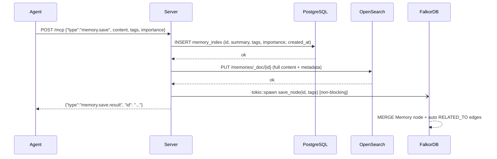
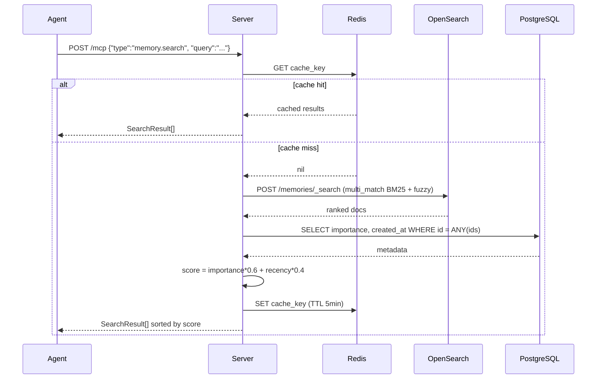
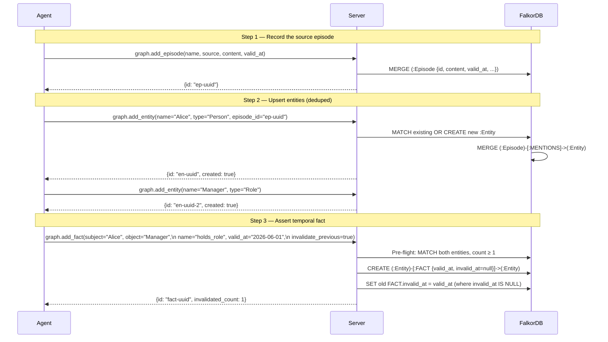
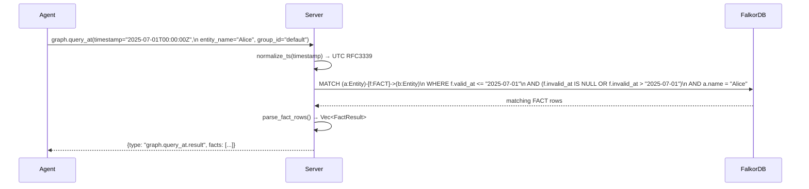
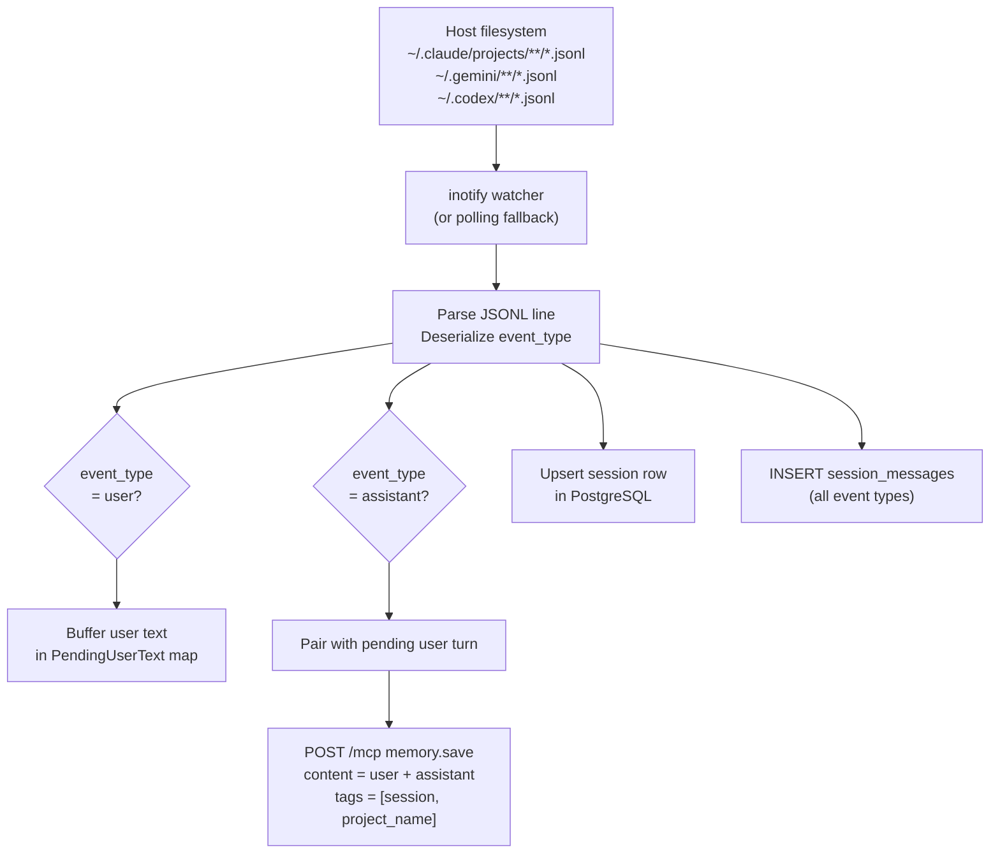
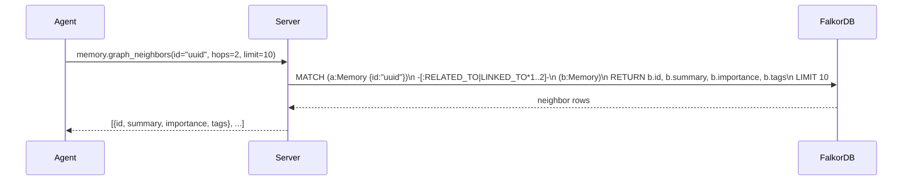
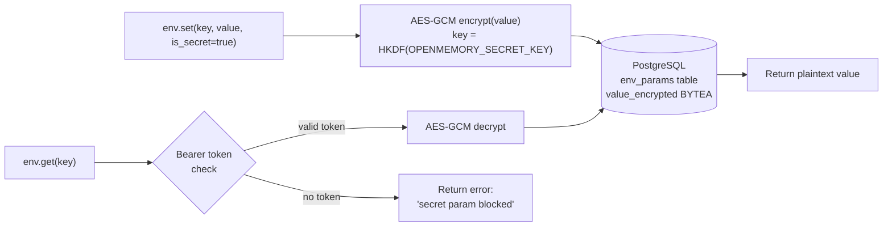

# OpenMemory — Operation Workflows

---

## 1. Memory Save (`memory.save`)

Persists content across three stores. FalkorDB write is fire-and-forget (non-blocking).

---

## 2. Memory Search (`memory.search`)

Hybrid BM25 + importance + recency scoring, with Redis cache.

---

## 3. Add Temporal Fact (full provenance flow)

The recommended pattern for an agent building a knowledge graph:

---

## 4. Time-Travel Query (`graph.query_at`)

Ask "what was true on a specific date?"

---

## 5. Session Watcher (background ingestion)

Automatically saves AI conversation turns as memories.

---

## 6. Graph Traversal — Neighbor Discovery

Find memories related to a known memory via shared tags or explicit links.

---

## 7. Env Param Storage (secrets)

Encrypted parameter store for API keys and secrets.

